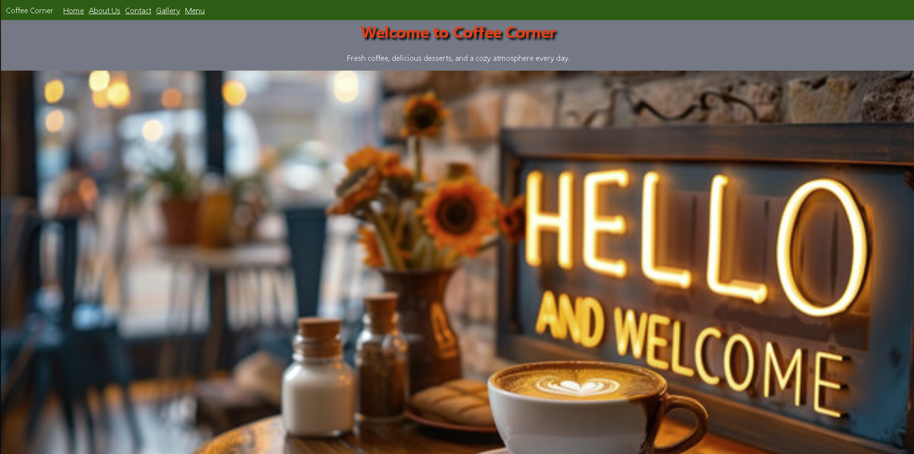
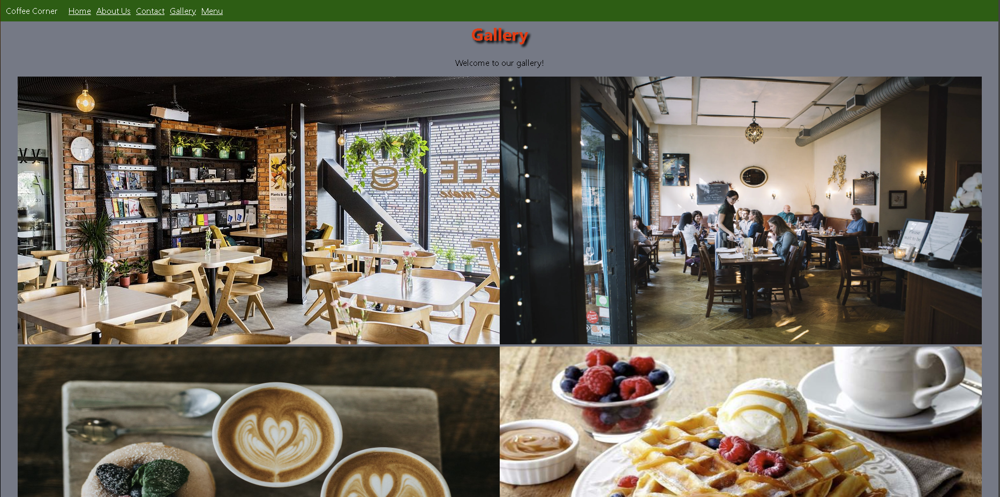
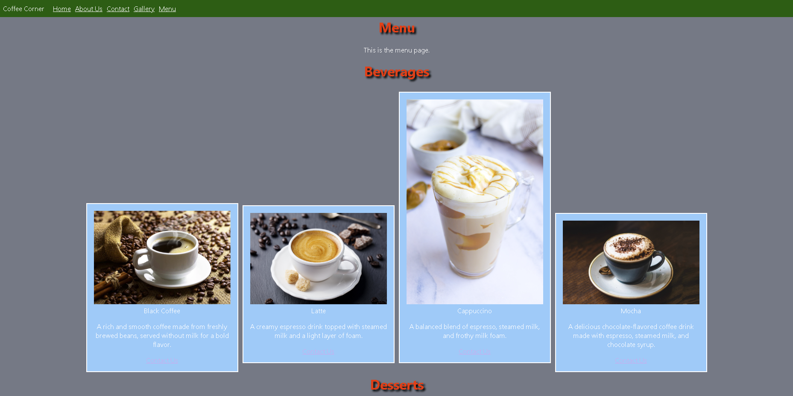

Coffee Corner Website Project
CSCI390 – Web Development Project-Phase 2
Prepared by: Mohammad Daniel Shamaa
 ID: 12432047

The Coffee Corner Website is a simple website made for a café. It allows users to view the menu, browse photos, learn about the café, and contact the business. The website was created using React JS, CSS, and Bootstrap. The goal of this project was to build a responsive and user-friendly website while applying the web development concepts learned.

The website is made up of five main pages:
•	Home Page
•	Menu Page
•	Gallery Page
•	About Us Page
•	Contact Us Page

you need to have node modules, boostrap, router library installed:

in cmd choose a file then enter this command to install react along with modules but you need to have node js installed:

npx create-react-app appname

in visual studio code enter this command in terminal to install bootstrap:

npm install react-bootstrap bootstrap

then to install react router enter this command:

npm install react-router-dom
### `npm start` in terminal to start
